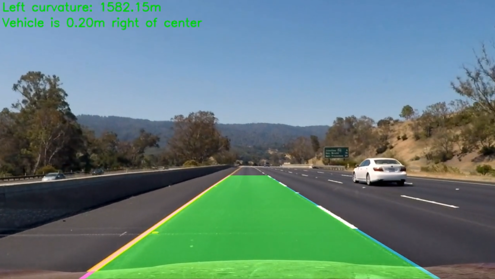

## Advanced Lane Finding Project



The goal of this project is to build a complete pipeline that automatically detects lane lines from a real video.

* Compute the camera calibration matrix and distortion coefficients given a set of chessboard images.
* Apply a distortion correction to raw images.
* Use color transforms, gradients, etc., to create a thresholded binary image.
* Apply a perspective transform to rectify binary image ("birds-eye view").
* Detect lane pixels and fit to find the lane boundary.
* Determine the curvature of the lane and vehicle position with respect to center.
* Warp the detected lane boundaries back onto the original image.
* Output visual display of the lane boundaries and numerical estimation of lane curvature and vehicle position.

---

### Camera Calibration

#### 1. Briefly state how you computed the camera matrix and distortion coefficients. Provide an example of a distortion corrected calibration image.

The camera needs to be calibrated using a series of chessboard images from which we will find the corners and extract a calibration coefficient that will allow to undistort the provided images. 
``` python
def find_corners(gray, n):
    objpoints = []  # 3D real points
    imgpoints = []  # 2D image points
    objp = np.zeros((n[0]*n[1], 3), dtype=np.float32)
    objp[:, :2] = np.mgrid[0:n[0], 0:n[1]].T.reshape(-1, 2)
    ret, corners = cv2.findChessboardCorners(gray, (n[0], n[1]), None)
    if ret is True:
        imgpoints.append(corners)
        objpoints.append(objp)
        
        return imgpoints, objpoints

    return None


def calibrate_undistort(image, imgpoints, objpoints):
    ret, mtx, dist, rvecs, tvecs = cv2.calibrateCamera(objpoints,
                                                       imgpoints,
                                                       image.shape[::-1],
                                                       None,
                                                       None)
    dst = cv2.undistort(image,
                        mtx,
                        dist,
                        None,
                        mtx)

    return dst, mtx, dist
```
As seen in the code snippet, after finding the 9x6 corners in the chessboard image, the exact points of the image are obtained and the undistortion is applied.
By also applying a perspective transform and drawing the found corners, it is possible to appreciate the correction.
 
[//]: # (Image References)

Original             |   Undistorted
:-------------------------:|:-------------------------:
  |  


### Pipeline (single images)

#### Calibrate & Undistort

After obtaining the distortion-correction coefficients from the chessboard image, the test images can be corrected as depicted below:

``` python
out = cv2.undistort(img, mtx, dist, None, mtx)
```

Original             |   Undistorted
:-------------------------:|:-------------------------:
  |  


#### Generate binary image

In order to generate a binary object where the lane lines can be easily identified, a combination of methods are applied to the original undistorted image.

* Transform to **HLS** color space, applying a threshold (120, 255) over the S channel.
``` python
def hls_thresh(img, thresh):
    s = img[:, :, 2]
    binary_s = np.zeros_like(s)
    binary_s[(s > thresh[0]) & (s <= thresh[1])] = 1

    return binary_s
```
* Obtain the magnitude of the **gradient** so thresholds (30, 100) can be set to identify pixels within a certain gradient range.
``` python
def gradient_magnitude(img, thresh, orient='x'):
    gray = cv2.cvtColor(img, cv2.COLOR_RGB2GRAY)
    if 'x' in orient:
        sobel = cv2.Sobel(gray, cv2.CV_64F, 1, 0)
    if 'y' in orient:
        sobel = cv2.Sobel(gray, cv2.CV_64F, 0, 1)
    abs_sobel = np.absolute(sobel)
    scaled_sobel = np.uint8(255*abs_sobel/np.max(abs_sobel))
    binary = np.zeros_like(scaled_sobel)
    binary[(scaled_sobel >= thresh[0]) & (scaled_sobel <= thresh[1])] = 1

    return binary
```
* Calculate the **direction of the gradient** to filter out the undesired stuff from the image. The sobel operator (derivative of the image in the x/y direction) had to be calculated  as well to obtain the direction of the gradient. The parameters used for this scenario were: `kernel = 15` and `threshold = (0.7, 1.3)`.
``` python
def dir_threshold(gray, abs_sobelx, abs_sobely, sobel_kernel=3, thresh=(0, np.pi/2)):
    direction = np.arctan2(abs_sobely, abs_sobelx)
    binary_output = np.zeros_like(direction)
    binary_output[(direction >= thresh[0]) & (direction <= thresh[1])] = 1

    return binary_output
```

Once these operations are performed on the original image, the results are combined following the below expression, to generate the output binary file where the lane lines are clearly identifiable, as seen in the example.

``` python 
combine = np.zeros_like(frame.gradient)
combine[(frame.gradient == 1) | ((frame.hls == 1) & (frame.direction == 1))] = 1
```

The above code snippet uses the `UndistImage` class (as `frame`), which was defined to store all relevant information for each of the analyzed images, so they can be easily accessible during the detection process and the combination of different manipulation methods.

``` python
def __init__(self, image, gray, hls, gradient, direction):
        self.image = image
        self.gray = gray
        self.hls = hls
        self.gradient = gradient
        self.direction = direction
```

Undistorted             |   Binary
:-------------------------:|:-------------------------:
  |  

#### Perspective transform

The binary image generated through the the combined manipulating methods in the previous step needs to be transformed to a bird's eye perspective so lane lines can be detected accurately.

First, one of the straight road images is processed so that a rectangular region of interest (where the lane is most likely located) is detected. The perspective transformation will be applied for this particular region, using the following source and destination points.

| Source       | Destination  | 
|:------------:|:------------:| 
| 570, 470     | 180, 250     | 
| 270, y_size  | 180, 720     |
| 720, 470     | 1000, 250    |
| 1050, y_size | 1000, 720    |

With the above points, the `getPerspectiveTransform` method is used to get both the transformation coefficient and the inverse transformations coefficient (which will be used at the end of the project to transform the image back to the original, so the lanes can be plotted on top).

``` python
def transform_perspective(img, src, offset=100):
    img_size = (img.shape[1], img.shape[0])
    dest = np.float32([[180, 250], [180, 720], [1000, 250], [1000, 720]])
    M = cv2.getPerspectiveTransform(src, dest)
    inv = cv2.getPerspectiveTransform(dest, src)
    warped = cv2.warpPerspective(img, M, (img_size[0], img_size[1]), flags=cv2.INTER_NEAREST)

    return warped, M, inv
```

Undistorted                |   Bird's eye binary
:-------------------------:|:-------------------------:
  |  

The lane lines appear considerably parallel, which indicates that the transformation was performed succesfully.

#### Lane detection

Then I did some other stuff and fit my lane lines with a 2nd order polynomial kinda like this:

![alt text][image5]

#### Identify lane lines

With the bird's eye view image, the lane lines can be detected using a second order polynomial. With this procedure, the lane lines are detected through a sliding window mechanism by analyzing the binary image incrementally (one window at a time) and updating the current position position of the line accordingly. Then, the x and y values are generated for plotting.

This part of the code is relatively large, it is located in `img_operation.py`, methods `fit_polynomial` and `identify_lanes`

The magnitudes are converted to meters so that the position of the car in the lane can be properly measured and the curvature can be identified.

Once the detection is done, the image is transformed back into the original perspective and the area contained by the lane lines is drawn into the original undistorted image, obtaining the following result.


Undistorted                |   Result
:-------------------------:|:-------------------------:
  |  


---

### Pipeline (video)

#### Video

The following is a link to the lane detection video.

[](https://youtu.be/cO7-e5DmqAQ)

---

### Discussion

#### 1. Briefly discuss any problems / issues you faced in your implementation of this project.  Where will your pipeline likely fail?  What could you do to make it more robust?

Here I'll talk about the approach I took, what techniques I used, what worked and why, where the pipeline might fail and how I might improve it if I were going to pursue this project further.  
